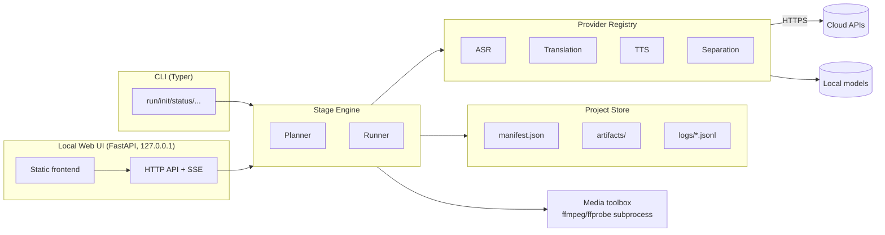

# dubstudio — v1 Design

Status: **authoritative**. This document is the canonical source of truth for v1
requirements and architecture. Issues in `docs/issues/` reference sections here by number.
Changes to requirements or architecture must land here first (see `docs/ISSUE_PLAN.md`).

Language policy: repository docs and issues are written in English. End-user docs ship in
English first with a Japanese quickstart (§2.1, I42).

---

## 1. Product Overview

### 1.1 Vision

dubstudio is a **local-first, open-source video dubbing pipeline** for individual
creators. It takes a video file, transcribes the speech, translates it, re-synthesizes the
speech in the target language **using a clone of the original speaker's voice**, replaces
the vocal track while preserving background audio, and exports a dubbed video plus
subtitle files.

One-line pitch: *"Publish your video in another language, in your own voice, from your own
machine."*

### 1.2 Personas

| Persona | Situation | Needs |
|---|---|---|
| Solo YouTuber / educator (primary) | Publishes ja or en videos, wants the other language | One command to a good draft; fast review/fix loop; costs visible upfront |
| Podcaster / screencaster | Voice-centric content, light BGM | High voice fidelity, subtitle exports |
| Tinkerer / privacy-conscious creator | No cloud upload of their media | Fully local mode (ASR/TTS/separation on device) |

### 1.3 Positioning

Compared to existing OSS dubbing tools (see `docs/research/2026-07-dubbing-tools-landscape.md`),
dubstudio differentiates on:

1. **Review-first quality loop** — transcript and translation are editable artifacts;
   any stage can be re-run incrementally after human edits (file-based or via the local
   review UI). Competitors are mostly "run and pray".
2. **Consent and provenance as features** — voice-clone consent gate, AI-disclosure
   metadata on outputs, watermark-by-default local TTS (§11.4).
3. **Clean provider abstraction** — every AI step is pluggable, local or cloud, with safe
   defaults and visible cost estimates (§7).
4. **Scope discipline** — no video downloading, no GUI monolith, no lip-sync in v1.

### 1.4 UX principles

- **P1 Draft in one command**: `dubstudio init` + `dubstudio run` must produce a complete
  dubbed video with defaults.
- **P2 Human-in-the-loop is cheap**: editing a translation then re-running touches only
  affected segments/stages (fingerprint-based staleness, §6.2).
- **P3 No surprises**: paid API usage above a threshold requires confirmation with an
  estimate (§7.6); destructive operations never happen implicitly.
- **P4 Local-first**: a fully offline path exists for every stage except translation
  (which can use a local OpenAI-compatible server such as Ollama).
- **P5 Honest output**: outputs are labeled as AI-generated dubbing (§11.4).

---

## 2. Scope

### 2.1 v1 scope

- Input: **one local video file** per project (mp4/mov/mkv/webm; any container ffmpeg can
  demux with an audio stream). Audio-only input (mp3/wav/m4a) is accepted and produces
  audio + subtitles outputs only.
- Languages: source language auto-detected or declared; **one or more target languages**
  per project, processed independently. Language-agnostic design; **ja↔en is the
  primary tested pair** (fixtures, docs examples, prompt tuning).
- Single speaker per project (**one cloned voice**); ADR-006.
- Pipeline: ingest → separate → transcribe → translate → voice_ref → synthesize → fit →
  mix → export, plus subtitles (§5).
- Providers (§7.5): ASR = faster-whisper (local) / OpenAI API; Translation =
  OpenAI-compatible LLM; Voice-clone TTS = Chatterbox Multilingual (local) / ElevenLabs;
  Non-clone TTS = OpenAI preset voices; Separation = Demucs (local).
- Surfaces: CLI (§9) + thin local review Web UI (§10).
- Outputs: dubbed video (original video stream copied, new audio track), SRT/VTT subtitles
  for source and target languages, per-run reports (fit report, cost summary).
- Safety: voice-clone consent gate, AI-disclosure metadata, secret redaction, localhost
  token-authenticated UI (§11).
- Distribution: PyPI package `dubstudio`, runnable via `uvx dubstudio` (§14).

### 2.2 v1 non-goals

- No lip-sync (v2, see issue 43).
- No speaker diarization / multi-speaker voice assignment (ADR-006).
- No video downloading (YouTube or otherwise) — users supply files they have rights to.
- No burned-in (hardcoded) subtitles; sidecar files and optional soft-sub track only.
- No cloud/multi-user service, no accounts, no telemetry.
- No realtime/streaming dubbing (OpenAI GPT-Live-1 family is out of scope; see
  `docs/research/2026-07-audio-model-landscape.md`).
- No dedicated MT engines (DeepL etc.) — v2 provider.
- No glossary/terminology management (v2).
- No video re-encoding beyond what muxing strictly requires.

### 2.3 v2 deferred ideas

Lip-sync stage (issue 43); diarization + per-speaker voices; DeepL/MT providers; glossary
support; burn-in subtitles; batch/multi-video projects; watermark verification command;
OS keyring secret storage; Windows CI; elastic timeline (retime video to fit speech);
waveform view in UI; ElevenLabs PVC; provider-level dubbing APIs comparison mode.

### 2.4 Known unknowns

Tracked in `docs/ISSUE_PLAN.md` §8. Highlights: OpenAI transcription API word-timestamp
fidelity; Chatterbox Japanese quality on real creator audio; atempo audibility beyond
1.15×; demucs CPU-only latency on long videos; Windows behavior; PyPI/npm name
availability and trademark check for "dubstudio" before first publish.

---

## 3. System Architecture

### 3.1 Component overview



Both surfaces (CLI, UI) drive the same engine; the engine is the only writer of project
state. The UI process embeds the engine in-process (no separate daemon).

### 3.2 Module layout

```
src/dubstudio/
  __init__.py            # __version__
  __main__.py            # python -m dubstudio
  cli/                   # Typer app; one module per command group
    app.py init.py run.py status.py segments.py voice.py providers_cmd.py
    consent_cmd.py doctor.py ui_cmd.py invalidate.py config_cmd.py
  core/
    errors.py            # error taxonomy + exit codes (§12)
    logging.py           # console + JSONL logging, redaction filter
    config.py            # config load/merge/validate (§8)
    consent.py           # consent gate (§11.4)
    hashing.py           # content + fingerprint hashing (§4.4)
    procs.py             # safe subprocess runner (§11.3)
  media/
    ffmpeg.py            # discovery, version check, command builders
    probe.py             # ffprobe → MediaInfo model
    audio.py             # wav helpers, loudness, silence, concat
  model/
    manifest.py segments.py translation.py synthesis.py fitreport.py events.py
  project/
    store.py             # atomic IO, artifact paths (§4)
    lock.py              # single-writer lock (§4.5)
  engine/
    graph.py             # stage DAG (§6)
    state.py             # status machine (§6.1)
    invalidate.py        # fingerprints/staleness (§6.2)
    runner.py            # execution, events, cancellation
    plan.py              # dry-run planning
  stages/
    ingest.py separate.py transcribe.py translate.py voice_ref.py
    synthesize.py fit.py mix.py export.py subtitles.py
  providers/
    base.py              # Protocols, capabilities, params models (§7.1–7.2)
    registry.py          # discovery + explicit activation (§7.3)
    errors.py cost.py
    mock.py              # deterministic mock providers (testing/CI)
    asr/faster_whisper.py asr/openai_asr.py
    mt/openai_llm.py
    tts/chatterbox.py tts/elevenlabs.py tts/openai_tts.py
    sep/demucs.py
  ui/
    server.py auth.py sse.py jobs.py
    api/ (routers)  static/ (index.html, app.css, ES-module *.js — no build step)
```

### 3.3 Runtime dependencies and extras

| Install | Contents |
|---|---|
| `dubstudio` (core) | typer, pydantic v2, httpx, rich, fastapi, uvicorn, platformdirs. Cloud providers work out of the box. **ffmpeg/ffprobe ≥ 6 is a required system dependency** (checked by `doctor`, §9). |
| `dubstudio[local-asr]` | faster-whisper (CTranslate2) |
| `dubstudio[separate]` | demucs (+ torch) |
| `dubstudio[local-tts]` | chatterbox-tts (+ torch) |
| `dubstudio[local]` | all of the above |

Python ≥ 3.12. Torch-based extras are optional precisely so the core install stays light.

---

## 4. Domain Model & Storage

File-based state, no database (ADR-002). All JSON written by dubstudio is UTF-8,
2-space-indented, trailing-newline, with a top-level `schema_version` integer.

### 4.1 Project directory layout

```
<project>/
  dubstudio.toml               # project config — user-editable (§8)
  manifest.json                # engine state — machine-managed
  artifacts/
    ingest/       source.wav probe.json
    separate/     vocals.wav background.wav
    transcribe/   transcript.json
    voice_ref/    reference.wav reference.json
    translate/<lang>/    translation.json
    synthesize/<lang>/   synth.json segments/<seg_id>.wav
    fit/<lang>/          fit_report.json segments/<seg_id>.wav
    mix/<lang>/          dubbed_audio.wav
    export/<lang>/       <input_basename>.<lang>.dub.mp4
    subtitles/           <source_lang>.srt <source_lang>.vtt
    subtitles/<lang>/    <lang>.srt <lang>.vtt
  logs/
    run-<UTC timestamp>.jsonl
  .dubstudio.lock              # single-writer lock (§4.5)
```

The input video is **referenced, not copied** (path + sha256 + size + mtime recorded).
`init --copy-input` copies it into `<project>/input/` for portability.

### 4.2 Manifest schema (`manifest.json`)

```json
{
  "schema_version": 1,
  "project_id": "d6f9…(uuid4)",
  "created_at": "2026-07-10T12:00:00Z",
  "input": {
    "path": "/abs/path/talk.mp4",
    "sha256": "…",
    "size_bytes": 123456789,
    "media": { "duration_ms": 600000, "video_codec": "h264", "audio_codec": "aac",
               "sample_rate": 48000, "channels": 2, "container": "mov,mp4,m4a…" }
  },
  "languages": { "source": "ja", "targets": ["en"] },
  "voice": { "mode": "auto", "user_ref_path": null },
  "stages": {
    "ingest":              { "status": "completed", "fingerprint": "sha256:…",
                             "started_at": "…", "finished_at": "…", "error": null },
    "separate":            { "status": "completed", "fingerprint": "…" },
    "transcribe":          { "status": "completed", "fingerprint": "…" },
    "voice_ref":           { "status": "completed", "fingerprint": "…" },
    "translate:en":        { "status": "completed", "fingerprint": "…" },
    "synthesize:en":       { "status": "stale",     "fingerprint": "…" },
    "fit:en":              { "status": "pending" },
    "mix:en":              { "status": "pending" },
    "export:en":           { "status": "pending" },
    "subtitles:en":        { "status": "pending" }
  },
  "consent_snapshot": { "policy_version": 1, "accepted_at": "2026-07-10T12:05:00Z" }
}
```

Stage keys are `name` for language-independent stages and `name:<lang>` for per-target
stages. Unknown fields must be preserved on rewrite (forward compatibility).

### 4.3 Segment-bearing artifact schemas

`transcribe/transcript.json`:

```json
{
  "schema_version": 1,
  "language": "ja",
  "provider": { "name": "faster-whisper", "model": "large-v3-turbo" },
  "segments": [
    {
      "id": "seg_0001",
      "start_ms": 1200,
      "end_ms": 4800,
      "text": "こんにちは、今日はパイプラインの話をします。",
      "words": [ { "w": "こんにちは", "start_ms": 1200, "end_ms": 1900 } ],
      "asr": { "avg_logprob": -0.21, "no_speech_prob": 0.01 }
    }
  ]
}
```

Segment IDs are `seg_` + zero-padded 4-digit index, assigned once at transcribe time and
**stable across edits** (edits change text, never IDs; splits/merges in v1 happen only in
transcribe post-processing before IDs are published).

`translate/<lang>/translation.json`:

```json
{
  "schema_version": 1,
  "source_language": "ja",
  "target_language": "en",
  "provider": { "name": "openai", "model": "…" },
  "segments": [
    {
      "id": "seg_0001",
      "source_text": "こんにちは、今日はパイプラインの話をします。",
      "text": "Hi! Today, let's talk about the pipeline.",
      "status": "draft",
      "char_budget": 54,
      "notes": null
    }
  ]
}
```

`status ∈ {draft, edited, approved}`. `draft` = machine output; `edited` = human-modified
(set automatically on import/PATCH when text differs); `approved` = human sign-off.
Statuses never block the pipeline in v1 (informational + UI filters), except that
`run --require-approved` fails if any segment is not `approved`.

`synthesize/<lang>/synth.json` (per segment): `id`, `audio` (relative path),
`duration_ms`, `text_hash`, `voice_hash`, `provider` `{name, model, params}`,
`created_at`. `fit/<lang>/fit_report.json` (per segment): `id`, `slot_ms`,
`available_ms`, `synth_ms`, `atempo`, `pad_ms`, `overrun_ms`,
`result ∈ {ok, shortened, warn_overflow}` plus file path of fitted audio.

### 4.4 Hashing and fingerprints

- `content_hash(file)` = sha256 of file bytes; `text_hash` = sha256 of NFC-normalized text.
- Each stage's **fingerprint** = sha256 over a canonical JSON of:
  `{schema: engine_fingerprint_version, inputs: [content/text hashes of upstream artifacts
  it consumes], config: <the config subset declared by the stage>, provider: {name, model,
  version-relevant params}}`.
- Per-segment work (synthesize/fit) additionally records per-segment hashes so only
  changed segments re-run (§6.2).

### 4.5 Atomicity and locking

- All JSON writes: write to `<file>.tmp` in the same directory, `fsync`, `os.replace`.
- `.dubstudio.lock`: exclusive advisory lock (`flock`/`msvcrt`) held by any mutating
  command and by the UI job runner; contains `{pid, started_at, command}`. A dead-pid
  stale lock is reclaimed with a warning. Read-only commands (`status`, UI GETs) don't
  take the lock.

### 4.6 Schema versioning

`schema_version` per file; v1 readers reject higher majors with a clear error
(`DS-CONFIG-004`). Migration hooks are stubbed (identity) in v1.

---

## 5. Pipeline Stages

Every stage: pure function of (project store, config, providers) → artifacts + manifest
update + events. Stages are idempotent: re-running a `completed`, non-stale stage is a
no-op. All intermediate audio is **WAV** (PCM s16le); mono 16 kHz for ASR consumption,
44.1 kHz for synthesis/mix chain unless a provider dictates otherwise.

### 5.1 `ingest`

- **Inputs**: input video path (manifest), config.
- **Behavior**: verify file exists & hash matches manifest (else `DS-MEDIA-002` with
  `invalidate --input` hint); run ffprobe → `probe.json`; validate: has audio stream,
  duration ≤ `limits.max_duration_min` (default 90), size ≤ `limits.max_input_gb`
  (default 8); extract audio → `ingest/source.wav` (44.1 kHz stereo, or mono if source is
  mono).
- **Outputs**: `source.wav`, `probe.json`.
- **Failure modes**: no audio stream (`DS-MEDIA-003`); unsupported/corrupt container
  (`DS-MEDIA-001`, includes ffmpeg stderr tail); over limits (`DS-MEDIA-004`).
- **Edge cases**: variable frame rate video is fine (audio-only path); multiple audio
  streams → picks default/first, `--audio-stream N` override recorded in config.

### 5.2 `separate`

- **Inputs**: `ingest/source.wav`.
- **Behavior**: two-stem separation via separation provider (§7.5) → `vocals.wav` +
  `background.wav` (44.1 kHz, same duration as source ±10 ms, asserted).
- **Skip rule**: `separate.enabled=false` → status `skipped`; downstream then uses
  `source.wav` as the "vocals" input for voice_ref/ASR, and `mix` uses **no bed** (§5.8).
- **Failure modes**: provider not installed (`DS-PROVIDER-005` with `uv pip install
  'dubstudio[separate]'` hint); OOM → suggest `separate.segment_len` chunking option.

### 5.3 `transcribe`

- **Inputs**: `vocals.wav` if separate completed else `source.wav`; source language
  (or auto-detect).
- **Behavior**: ASR provider → raw segments with word timestamps where supported; then
  deterministic post-processing (in-engine, provider-independent):
  1. drop segments with `no_speech_prob > 0.85` or empty text;
  2. merge a segment into the previous one if its duration < 600 ms **and** gap < 200 ms;
  3. split segments > 12 s at the word boundary nearest a sentence punctuation mark
     closest to the midpoint (fallback: nearest word boundary to midpoint);
  4. collapse ≥ 3 identical consecutive texts (Whisper hallucination heuristic) to one,
     logging a warning;
  5. assign `seg_NNNN` IDs.
  Thresholds configurable under `[transcribe]`.
- **Outputs**: `transcript.json`; detected language written to manifest if it was `auto`.
- **Failure modes**: silent/no-speech input → `DS-STAGE-002` "no speech detected";
  language detection confidence < 0.5 → warning, proceeds.

### 5.4 `translate` (per target language)

- **Inputs**: `transcript.json`, target language, style config.
- **Behavior**: compute per-segment `char_budget = slot_seconds ×
  chars_per_second[target]` (built-in table, config-overridable; en=15, ja=9 defaults);
  call translation provider with **windows of up to 20 segments** plus a deterministic
  context block (concatenation of the final translations of up to the 3 preceding
  segments, truncated to 400 chars — no LLM summarization in v1); provider must return
  strict JSON (id → text) — validated, retried once on schema violation
  (`DS-PROVIDER-007` after retry).
  Existing segments with `status ∈ {edited, approved}` are **never overwritten**
  (re-translate only `draft` segments unless `--force-retranslate`).
- **Prompting requirements** (spec for I16): spoken-register translation; keep meaning,
  no additions; target ≤ char_budget chars (soft); keep numbers/proper nouns; output JSON
  only. Prompt text lives in-repo, versioned; prompt hash participates in fingerprint.
- **Outputs**: `translation.json`.
- **Failure modes**: provider auth (`DS-PROVIDER-002`), rate limits with backoff then
  `DS-PROVIDER-003`, malformed JSON after retry (`DS-PROVIDER-007`).

### 5.5 `voice_ref`

- **Inputs**: `vocals.wav` (or `source.wav` if separation skipped), transcript,
  optional user reference (`voice.user_ref_path`).
- **Behavior**: if user provided a reference file: validate (mono-able, 10 s–5 min,
  sample rate ≥ 16 kHz), convert to `reference.wav` (44.1 kHz mono).
  Else auto-build: score transcript segments by (duration 3–15 s, high `avg_logprob`, low
  clipping ratio, loudness within −30..−10 LUFS window, no overlapping music — vocals
  stem RMS dominance), pick top segments totaling `voice_ref.target_seconds` (default 60,
  min 20), concatenate with 300 ms silences → `reference.wav`; write `reference.json`
  provenance `{spans: [{segment_id, start_ms, end_ms}], built_at, source: "auto"|"user"}`.
- **Consent**: building or using a voice reference requires the consent gate (§11.4)
  already accepted; otherwise fail with `DS-CONSENT-001`.
- **Failure modes**: < 20 s usable clean speech → `DS-STAGE-003` with guidance to supply
  `voice set --ref`.

### 5.6 `synthesize` (per target language)

- **Inputs**: `translation.json`, `reference.wav`, TTS provider.
- **Behavior**: `prepare_voice(reference)` once per (provider, voice_hash) — e.g.
  ElevenLabs IVC voice creation (cached voice id in `synth.json` header; `cleanup_voice`
  on `invalidate --stage synthesize`); then per segment where
  `sha256(text)+voice_hash+params` differs from cache: `synthesize(text)` →
  `segments/<id>.wav` (44.1 kHz mono). Concurrency `synthesize.concurrency` (default 2)
  with exponential backoff honoring `Retry-After`. Cost estimate + confirmation gate
  before first paid call (§7.6).
- **Outputs**: `synth.json`, per-segment WAVs.
- **Failure modes**: consent missing (`DS-CONSENT-001`); provider quota
  (`DS-PROVIDER-003`); per-segment synth failure → recorded, stage fails at end listing
  failed segment ids (partial results kept; re-run resumes).

### 5.7 `fit` (per target language)

- **Inputs**: `synth.json` audio, transcript timings, translation, config `[fit]`.
- **Behavior** per segment:
  `slot_ms = end_ms − start_ms`; `available_ms = slot_ms + min(gap_to_next × 0.8,
  fit.max_bleed_ms=1500)`; `ratio = synth_ms / available_ms`.
  - ratio ≤ 1 → keep speed; pad to slot (start-aligned).
  - 1 < ratio ≤ `fit.atempo_max` (default 1.15) → ffmpeg `atempo=ratio`.
  - ratio > atempo_max and `fit.auto_shorten=true` (default) and segment `status ==
    draft` → one re-translate pass for that segment with `char_budget × 0.8`, then
    re-synthesize, re-measure (result `shortened`).
  - still over → apply atempo_max, allow overrun into gap, `warn_overflow` (never
    truncate audio; if overrun would collide with next segment start, log collision
    warning with ms).
  - `fit.atempo_min` (default 0.9) floors slow-down when synth is much shorter than a
    fluent-sounding minimum — otherwise short segments are just padded.
- **Outputs**: `fit_report.json`, fitted per-segment WAVs.
- **Edge cases**: segment 0 leading silence preserved; final segment may bleed to video
  end minus 200 ms.

### 5.8 `mix` (per target language)

- **Inputs**: fitted segment WAVs + timings; `background.wav` if separate completed.
- **Behavior**: place fitted segments on a silent timeline of exactly the source
  duration; if background exists: `amix` with `background_gain_db` (default −3 dB) —
  no ducking in v1; two-pass `loudnorm` to `mix.loudness_lufs` (default −16 LUFS, true
  peak −1.5 dBTP) → `dubbed_audio.wav` (48 kHz stereo).
- **Failure modes**: duration drift > 100 ms vs source → `DS-STAGE-004` (bug guard).

### 5.9 `export` (per target language)

- **Inputs**: input video, `dubbed_audio.wav`.
- **Behavior**: mux with **video stream copy** (never re-encode video); audio encoded
  AAC 192 kbps (mp4/mov) or Opus 128 kbps (mkv/webm); dubbed track is default with
  language tag; `export.keep_original_audio=true` (default) adds original audio as
  second, non-default track; `export.embed_subtitles=true` (default false) adds soft
  subtitle tracks (mov_text for mp4, srt for mkv). Container defaults to input container;
  `export.container` overrides. Writes AI-disclosure metadata tags (§11.4).
- **Failure modes**: codec/container mux incompatibility → `DS-MEDIA-005` suggesting
  `export.container = "mkv"`.

### 5.10 `subtitles`

- **Inputs**: `transcript.json` (source), each `translation.json` (targets).
- **Behavior**: emit SRT and VTT per language. Line wrapping: max
  `subtitles.max_chars_per_line` (default 42; 21 for ja/zh/ko) × 2 lines; split at word
  boundaries (space-delimited languages) or punctuation/character boundaries (ja/zh);
  segments longer than 2 lines split into sequential cues at word timestamps when
  available, else proportional time split. Timing offsets: none (cues use segment times).
  In-repo serializers; no third-party subtitle deps.
- **Outputs**: `subtitles/<lang>.{srt,vtt}` (source at `subtitles/`, targets under
  `subtitles/<lang>/`).

---

## 6. Stage Engine

### 6.1 Statuses and transitions

`pending | running | completed | failed | stale | skipped`

| From → To | Trigger |
|---|---|
| pending → running | runner starts stage (all deps completed/skipped) |
| running → completed | stage returns OK |
| running → failed | exception (error persisted to manifest) |
| completed → stale | fingerprint mismatch detected at plan time (§6.2) |
| stale → running | re-run |
| failed → running | retry via `run` |
| pending/completed → skipped | disabled by config (only `separate` in v1) |
| skipped → pending | re-enabled by config |

Cancellation (SIGINT/`jobs/cancel`): current stage's partial per-segment outputs are
kept; stage status rolls back to its pre-run value (`pending`/`stale`); in-flight
subprocess is terminated (SIGTERM, 5 s, SIGKILL).

### 6.2 Staleness and invalidation

At plan time, each stage's stored fingerprint is recompared against the freshly computed
one (§4.4). Mismatch → `stale`, and staleness **cascades to all descendants**.
Per-segment granularity: synthesize/fit consult per-segment hashes and re-process only
changed segments even when the stage is stale. Manual: `dubstudio invalidate --stage
<name> [--lang L] [--cascade]` and `--input` (re-hash input file).

### 6.3 Dependency graph

```
ingest → separate → transcribe → translate:L → synthesize:L → fit:L → mix:L → export:L
             ↘ voice_ref ────────────────────↗
transcribe → subtitles:L (also consumes translate:L)
```

`voice_ref` depends on `separate` (or `ingest` when separation skipped) and
`transcribe`. `subtitles:L` depends on `transcribe` + `translate:L`. Per-language chains
are independent; v1 runs languages sequentially (no cross-language parallelism).

### 6.4 Planning and dry-run

`dubstudio plan` (and `run --dry-run`) prints the ordered list of stages that would run,
why (pending/stale/failed), per-stage cache hit counts (segments to synth), and a cost
estimate (§7.6) — without side effects.

### 6.5 Run events

Runner emits JSONL events to `logs/run-<ts>.jsonl` and an in-process bus (consumed by
CLI progress rendering and UI SSE):
`{ts, run_id, level, event, stage, lang, segment_id?, message, data?}` with
`event ∈ {run_started, stage_started, stage_progress, segment_completed, stage_completed,
stage_failed, warning, cost_estimate, run_completed, run_failed, run_cancelled}`.

---

## 7. Provider Abstraction

### 7.1 Protocols (in `providers/base.py`)

```python
class AsrProvider(Protocol):
    info: ProviderInfo                      # name, kind, version
    def capabilities(self) -> AsrCaps: ...  # word_timestamps: bool, languages: set|ALL
    def transcribe(self, audio: Path, *, language: str | None,
                   on_progress: Progress) -> RawTranscript: ...

class TranslationProvider(Protocol):
    info: ProviderInfo
    def translate(self, req: TranslateRequest) -> TranslateResult: ...
    # req: list[SegmentIn(id, text, char_budget)], source_lang, target_lang,
    #      context_summary: str, style: StyleHints

class TtsProvider(Protocol):
    info: ProviderInfo
    def capabilities(self) -> TtsCaps: ...
    # TtsCaps: supports_cloning: bool, languages, watermark_builtin: bool,
    #          max_chars_per_request: int
    def prepare_voice(self, ref: VoiceReference | None) -> VoiceHandle: ...
    def synthesize(self, text: str, voice: VoiceHandle, *, language: str,
                   params: TtsParams) -> SynthAudio: ...
    def cleanup_voice(self, voice: VoiceHandle) -> None: ...

class SeparationProvider(Protocol):
    info: ProviderInfo
    def separate(self, audio: Path, out_dir: Path,
                 on_progress: Progress) -> SeparationResult: ...
```

All providers may implement `estimate_cost(work) -> CostEstimate | None` and
`healthcheck() -> HealthReport` (used by `doctor`).

### 7.2 Capability rules

- Engine checks `supports_cloning` before synthesize; using a non-cloning TTS (OpenAI
  preset voices) is allowed with explicit config `tts.allow_non_cloned_voice = true` and
  produces a "preset voice" note in disclosure metadata (§11.4).
- Engine checks language support and fails at plan time (`DS-PROVIDER-006`) rather than
  mid-run.

### 7.3 Registry and plugins

- Built-ins registered statically by name: `faster-whisper`, `openai-asr`, `openai`,
  `elevenlabs`, `chatterbox`, `openai-tts`, `demucs`, `mock-*`.
- Third-party: entry-point group `dubstudio.providers`; **discovered but not activated**
  — a plugin runs only if named in `providers.enabled_plugins` (§8, ADR-003, §11.3).
- Selection per slot in config: `[providers] asr/translation/tts/separation = "<name>"`.

### 7.4 Provider error taxonomy

`ProviderAuthError` (bad/missing key), `ProviderQuotaError` (429/quota, carries
retry-after), `ProviderInvalidResponse`, `ProviderNotInstalled` (missing extra),
`ProviderUnsupported` (capability), `ProviderRemoteError` (5xx). Mapped to exit codes in
§12. All retryable errors: max 5 attempts, exponential backoff with jitter, cap 60 s.

### 7.5 Built-in provider matrix (v1)

| Slot | Provider (config name) | Mode | Notes (see research doc) |
|---|---|---|---|
| ASR | `faster-whisper` (default) | local, extra `local-asr` | model `large-v3-turbo` default; `word_timestamps=True` |
| ASR | `openai-asr` | cloud | `gpt-4o-mini-transcribe` default; chunk >20 MB inputs at silence boundaries; verify timestamp granularity at impl time |
| Translation | `openai` (default) | cloud/local | OpenAI-compatible Chat Completions; `base_url` override supports Ollama/LM Studio; JSON-strict output |
| TTS | `chatterbox` (default) | local, extra `local-tts` | Chatterbox Multilingual; MIT; ja/en; PerTh watermark built-in |
| TTS | `elevenlabs` | cloud | IVC + TTS; `eleven_multilingual_v2` default, `eleven_v3` opt-in |
| TTS | `openai-tts` | cloud | preset voices only (non-clone fallback); `gpt-4o-mini-tts` |
| Separation | `demucs` (default) | local, extra `separate` | `htdemucs` two-stem |

Defaults favor local-first (P4); `init` warns when a selected provider needs an API key
that is not set.

### 7.6 Cost transparency

Cloud providers implement `estimate_cost` from a static, config-overridable price table
(`[cost.tables]`) — estimates are labeled approximate. Before executing paid work whose
estimate exceeds `cost.confirm_over_usd` (default 5.0), the CLI prompts (TTY) or fails
with `DS-COST-001` (non-TTY) unless `--yes`. Actual usage (chars/seconds/tokens) is
logged per run in the run summary event.

---

## 8. Configuration

### 8.1 Files and precedence (low → high)

1. Built-in defaults
2. User config: `~/.config/dubstudio/config.toml` (via platformdirs; XDG respected)
3. Project config: `<project>/dubstudio.toml`
4. Environment: `DUBSTUDIO_*` (double-underscore nesting: `DUBSTUDIO_FIT__ATEMPO_MAX`)
5. CLI flags

### 8.2 Schema (pydantic-settings; full table in issue I06)

Top-level tables: `[project]` (input, source_language, target_languages),
`[providers]`, `[asr.*]`, `[translation.*]`, `[tts.*]`, `[separation.*]`,
`[transcribe]`, `[fit]`, `[mix]`, `[export]`, `[subtitles]`, `[voice_ref]`,
`[limits]`, `[cost]`, `[ui]`, `[logging]`, `providers.enabled_plugins = []`.
Unknown keys → error with a did-you-mean suggestion (typo safety).

### 8.3 Secrets

API keys come **only** from environment variables (`OPENAI_API_KEY`,
`ELEVENLABS_API_KEY`, or provider-specific `DUBSTUDIO_<PROVIDER>_API_KEY` overrides) or
a project/user `.env` file loaded at startup (never committed; `init` writes
`.gitignore` including `.env`, `artifacts/`, `logs/`, `manifest.json` optional).
Any key-like value found in TOML (`api_key`, `token`, …) is **rejected** with
`DS-CONFIG-003` telling the user to move it to env. Keys never appear in manifest,
artifacts, logs (redaction filter, §12), or error messages.

---

## 9. CLI Specification

Conventions: Typer app; `--json` on read commands for machine output; `--quiet/-q`,
`--verbose/-v`; all commands run from inside a project dir or with `--project PATH`;
non-TTY never prompts (fails closed with the specific exit code).

| Command | Purpose |
|---|---|
| `dubstudio init [DIR] --input F --source-lang ja --target-lang en [--target-lang …] [--copy-input]` | Create project (validates input via ffprobe; writes dubstudio.toml, manifest, .gitignore) |
| `dubstudio run [--until S] [--only S] [--from S] [--target L] [--dry-run] [--yes] [--require-approved]` | Execute pipeline (default: everything pending/stale) |
| `dubstudio plan` | Alias of `run --dry-run` |
| `dubstudio status [--json]` | Stage table, per-lang, warnings, next suggested action |
| `dubstudio segments export --lang L [--to F]` / `segments import --lang L --from F` | HITL round-trip editing of translations (validates ids/schema; sets `edited`) |
| `dubstudio voice set --ref F` / `voice auto` / `voice show` | Manage reference voice |
| `dubstudio consent [--status] [--accept] [--revoke]` | Voice-clone consent gate (§11.4) |
| `dubstudio providers list [--json]` | Providers, capabilities, key/extra status |
| `dubstudio invalidate --stage S [--lang L] [--cascade] \| --input` | Force staleness |
| `dubstudio doctor [--json]` | Environment diagnosis: ffmpeg presence/version, keys set (names only), extras importable, disk space, GPU/MPS detection, config validity |
| `dubstudio ui [--port N] [--no-browser]` | Launch review UI (§10) |
| `dubstudio config show [--json]` | Effective merged config with secrets masked |
| `dubstudio version` | Version + commit |

Exit codes: `0` OK; `2` usage; `3` consent declined/missing; `4` config invalid;
`5` media invalid; `6` provider auth; `7` provider quota/rate; `8` provider other;
`9` stage failed; `10` cancelled; `11` cost confirmation required; `12` environment
missing (ffmpeg/extras); `13` lock held.

---

## 10. Web UI (thin review surface)

### 10.1 Goals / non-goals

Goals: review & edit translations per segment; listen to original vs. dubbed audio per
segment; re-synthesize edited segments; run/monitor pipeline; see fit warnings.
Non-goals: project creation, waveform editing, timeline dragging, multi-project
management, remote access.

### 10.2 Server architecture and auth

- FastAPI + uvicorn, **bind 127.0.0.1 only** (not configurable to 0.0.0.0 in v1).
- Launch: `dubstudio ui` generates `token = secrets.token_urlsafe(32)`, prints
  `http://127.0.0.1:<port>/?token=…`, opens browser. First GET with valid `?token=`
  sets an HttpOnly, SameSite=Strict session cookie and redirects to `/`.
- Every API request requires the session cookie; **mutating requests additionally
  require header `X-Dubstudio-Csrf` equal to the token** (double-submit).
- Host header must be `127.0.0.1[:port]` or `localhost[:port]` (DNS-rebinding guard);
  CSP `default-src 'self'`; `X-Content-Type-Options: nosniff`; no CORS headers.
- One project per server instance (the CWD project); artifact access is by **id-based
  routes resolved server-side** — no client-supplied paths.

### 10.3 HTTP API

| Method & path | Body / params | Returns |
|---|---|---|
| `GET /api/project` | — | manifest summary, languages, stage statuses |
| `GET /api/segments?lang=L` | — | merged rows: id, times, source_text, target text/status, synth/fit info, warnings |
| `PATCH /api/segments/{id}?lang=L` | `{text?, status?}` | updated row (writes translation.json atomically; marks per-segment staleness) |
| `POST /api/segments/{id}/resynthesize?lang=L` | — | job ref (runs synthesize+fit for one segment) |
| `GET /api/audio/{kind}/{id}?lang=L` | kind ∈ source\|synth\|fit | audio/wav stream (Range supported) |
| `GET /api/fit-report?lang=L` | — | fit_report.json |
| `POST /api/run` | `{until?, only?, lang?}` | `{job_id}` — 409 if a job is active |
| `GET /api/jobs/{id}` / `POST /api/jobs/{id}/cancel` | — | job status |
| `GET /api/events` | SSE | engine events (§6.5) + heartbeat every 15 s |

`GET /api/audio/source/{id}` serves the original vocal slice for a segment (cut on the
fly from vocals/source WAV with ffmpeg, cached under `artifacts/ui_cache/`).

### 10.4 Frontend

No build step: `index.html` + vanilla ES modules + CSS (dark/light via
`prefers-color-scheme`). Views: **Segments table** (virtualized list; inline edit;
status chips; per-row play buttons original/dub; fit warning badges; filter by
status/warning) and **Pipeline panel** (stage cards with status, run/until controls,
live progress from SSE, cost estimate display, link to fit report). Accessibility:
keyboard row navigation, `aria-live` progress.

---

## 11. Security Model

### 11.1 Assets and adversaries

Assets: provider API keys; user's media files; consent records; output integrity;
host filesystem. Adversaries/abuse cases: malicious media file; malicious web page in
the user's browser attacking the localhost UI; co-resident local process; malicious
model file or download MITM; malicious third-party provider plugin; compromised
dependency; **abusive user cloning a voice they have no rights to**.

### 11.2 Trust boundaries and expectations

| # | Boundary | Threats | Controls |
|---|---|---|---|
| B1 | Media file → ffmpeg/ffprobe | parser exploits, decompression bombs | ffprobe validation before processing; size/duration limits (§5.1); pinned minimum ffmpeg ≥ 6 with version warning; subprocess with argument lists (never shell), timeouts, output size caps; SECURITY.md documents that untrusted media should be handled in a sandboxed env |
| B2 | Engine → cloud APIs (HTTPS) | key leakage, MITM, data privacy | httpx with TLS verification (never disabled); keys from env only (§8.3); redaction in logs; docs state exactly which data leaves the machine per provider; local-first defaults |
| B3 | Browser ↔ localhost UI | CSRF, DNS rebinding, token theft, XSS | token auth + SameSite=Strict cookie + CSRF header (double submit); Host allowlist; 127.0.0.1 bind; CSP `default-src 'self'`; all rendering via `textContent` (no innerHTML with user data); no external assets |
| B4 | Model/weights downloads | tampered weights, pickle RCE | official sources (HF repos pinned by name+revision); safetensors preferred; sha256 recorded on first download and verified after (TOFU + lockfile in user cache); no `trust_remote_code` |
| B5 | Third-party provider plugins | arbitrary code execution | plugins run in-process **only when explicitly enabled by name** in config; docs: installing a plugin = trusting its author; `providers list` marks third-party |
| B6 | Project files (manifest/segments) edited by user or UI | schema abuse, path injection | pydantic validation on read; artifact paths always resolved relative to project root and checked with `Path.is_relative_to`; ids validated `^seg_\d{4}$` |
| B7 | Dependencies / release | supply chain | uv.lock committed; Dependabot; CodeQL; pip-audit in CI; PyPI Trusted Publishing (OIDC, no long-lived tokens); release requires tag + CI green |

### 11.3 Subprocess & filesystem policy

Single helper (`core/procs.py`): list-form argv only; explicit `env` allowlist (PATH,
HOME, provider keys never passed to ffmpeg); cwd = project dir; wall-clock timeout per
call (default 2× media duration + 120 s); stdout/stderr captured with 1 MB tail
retention. All writes go under the project dir or the user cache dir
(`platformdirs.user_cache_dir("dubstudio")`); nothing else is written.

### 11.4 Voice-clone consent and provenance

- **Consent gate**: first use of `voice_ref`/`synthesize` (or `consent --accept`)
  requires interactive acknowledgment of the Voice & Likeness Policy:
  *"I confirm I have the legal right and the speaker's consent to clone every voice I
  process, and I will disclose AI-generated audio where required."* Recorded in
  `~/.config/dubstudio/consent.json` `{policy_version, accepted_at}`; snapshot copied
  into each project manifest at synth time. Non-interactive: env
  `DUBSTUDIO_ACCEPT_VOICE_POLICY=1` (records acceptance with `method: "env"`).
  Declining → exit 3, no cloning performed. Policy text is versioned; a version bump
  re-triggers the gate.
- **Provenance/disclosure**: `export` writes container metadata:
  `comment = "Audio dubbed with AI voice cloning (dubstudio vX.Y; consent policy vN
  accepted)"` plus `DUBSTUDIO=ai-dubbed` custom tag where supported; subtitle files get a
  header comment cue. Default local TTS (Chatterbox) embeds PerTh audio watermarking on
  every output; capability surfaced as `watermark_builtin` and shown in `providers list`.
- **Abuse posture docs**: README + `docs/POLICY.md` (shipped) state prohibited uses
  (impersonation, fraud, harassment, non-consensual cloning), reporting contact, and
  jurisdictional disclosure duties. SECURITY.md covers vulnerability reporting
  separately.

### 11.5 Privacy

No telemetry, no phoning home, no update checks in v1. Cloud calls happen only for
explicitly selected providers; `dubstudio plan` shows which stages will leave the
machine (`[cloud]` badge per stage).

### 11.6 Release security

See B7. Additionally: repository rulesets protect `main` (PR required); GitHub Actions
pinned by SHA; least-privilege workflow permissions (`contents: read` default);
pre-publish name check (PyPI `dubstudio` availability/squatting) tracked as unknown U-06.

---

## 12. Error Handling & Logging

- Error codes: `DS-<AREA>-<NNN>` with areas CONFIG, MEDIA, PROVIDER, STAGE, CONSENT,
  COST, LOCK, UI. Every user-facing error: one-line summary, cause detail, **next-step
  hint**, and docs anchor. Full table maintained in `core/errors.py` and rendered into
  user docs (I42).
- Logging: rich console (INFO default; `-v` DEBUG); JSONL run logs (§6.5) always at
  DEBUG level; redaction filter masks any value of env vars matching
  `*_API_KEY|*_TOKEN|*_SECRET` and `Authorization` headers everywhere (console, files,
  exceptions).
- Crash policy: unexpected exceptions print a short message + log path; `--verbose`
  prints traceback; exit 9.

## 13. Testing & QA Strategy

| Layer | Approach |
|---|---|
| Unit | pytest, no network/binaries; pure logic (fit math, wrapping, hashing, config merge, schemas) |
| Provider contract | httpx mocking (respx) for cloud providers: auth, retry/backoff, error mapping, JSON-strictness; recorded-shape fixtures |
| Engine | mock providers (`providers/mock.py`, deterministic: MockAsr emits fixture transcript; MockTts emits silence of len(text)×k ms) exercising staleness, resume, cancellation, per-segment cache |
| Media | tests gated on ffmpeg presence (CI installs it); fixture video generated by `tests/fixtures/make_fixture.py` (ffmpeg testsrc + sine beeps, ~10 s, no binaries committed) |
| Golden E2E | init → run with mocks → assert artifact tree, manifest completed, SRT golden match, output duration within ±50 ms |
| Live smoke (opt-in) | `DUBSTUDIO_LIVE_TESTS=1` + keys; 5 s clip; asserts estimate < $0.10 before running; never in CI by default |
| UI | FastAPI TestClient: auth/CSRF/Host guards, PATCH staleness, SSE handshake; frontend logic kept minimal enough to skip browser automation in v1 |
| Static | ruff (lint+format), mypy --strict on `core/engine/model/providers/base`, pip-audit |
| Coverage gate | engine/model/core ≥ 90%, project ≥ 80% |

## 14. Packaging & Release

PyPI `dubstudio`; SemVer 0.x during v1; `uvx dubstudio` and `pipx install dubstudio`
documented paths. Release flow: tag `vX.Y.Z` → CI (full test matrix) → build sdist+wheel
→ PyPI Trusted Publishing (OIDC) → GitHub Release with generated notes + CHANGELOG
(keep-a-changelog). Version single-sourced in `pyproject.toml`, exposed as
`dubstudio.__version__`.

## 15. Performance & Resource Assumptions (to validate, U-04)

Reference: 10-min 1080p talk video, M-series MacBook: ingest < 30 s; demucs ≈ 1–4 min
(CPU) / faster with MPS; faster-whisper turbo ≈ 1 min; synthesis dominated by provider.
Disk: artifacts ≈ 5× extracted-audio size. Long inputs guarded by `limits.*` (§5.1).
No streaming design in v1; stages hold at most one decoded track in memory.

## 16. Compatibility

macOS 13+ (arm64 = primary dev target) and Linux x86_64 (CI) are supported; Windows is
best-effort/untested (U-05). Python 3.12/3.13. ffmpeg ≥ 6 required. GPU optional
(CUDA/MPS auto-detected by local providers; CPU fallback always works).

## 17. Glossary

**Segment**: contiguous speech span with timestamps — the atomic unit of translation,
synthesis, and editing. **Slot**: a segment's original time window. **Fit**: adapting
synthesized audio to its slot. **Stem**: separated audio component (vocals/background).
**Fingerprint**: hash controlling staleness. **IVC**: ElevenLabs Instant Voice Cloning.
**HITL**: human-in-the-loop.
